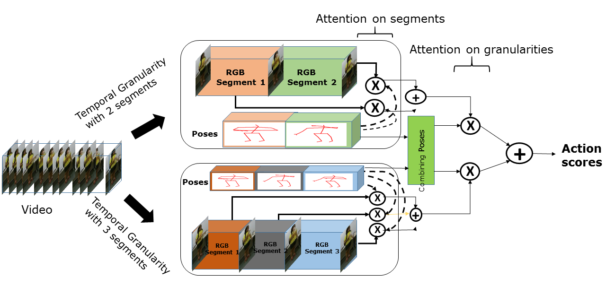

# Temporal Model (WACV 2020)

## REQUIRED PACKAGES AND DEPENDENCIES

* python 3.6.8
* Tensorflow 1.13.0 (GPU compatible)
* keras 2.3.1
* scikit-image 0.16.2
* Pillow 6.2.1
* OpenCV 4.1.2
* Cuda 10.0
* CuDNN 7.4
* tqdm 4.41.1

## INSTALLATION INSTRUCTIONS

Ensure that Cuda 10.0 and CuDNN 7.4 are installed to use GPU capabilities.

Ensure Anaconda 4.7 or above is installed using `conda info`, else refer to the [Anaconda documentation](https://docs.anaconda.com/anaconda/install/)

The following commands can then be used to install the dependencies:

```bash
conda create --name temporal_model_env tensorflow-gpu==1.13.1 keras scikit-image opencv
```
## EXECUTION

```bash
conda activate temporal_model_env
python main.py (optional arguments)
```

## PRE-TRAINED MODELS

The pretrained 3DCNN model can be downloaded from https://drive.google.com/drive/folders/1WE5srEZjth_Or1--lLG3cwCuqjugsDh1?usp=sharing. Extract to the data folder.

To extract and use the skeleton information, use the link provided above to download and unzip the files into the ```data/NTU_CS/``` folder. For any dataset, skeleton files should be kept in the corresponding ```data/DATASET``` folder.

## I3D segment wise Features

Can be extracted using scripts in scripts/segment_extraction/ folder. Refer to the instructions [here](https://github.com/srijandas07/temporal_model/blob/master/scripts/segment_extraction/README.md).

## Reference
<a id="1">[1]</a>
S. Das, F. Bremond and M. Thonnat. "Looking deeper into Time for Activities of Daily Living Recognition". In Proceedings of the IEEE Winter Conference on Applications of Computer Vision, WACV 2020, Snowmass village, Colorado, March 2-5, 2020.
